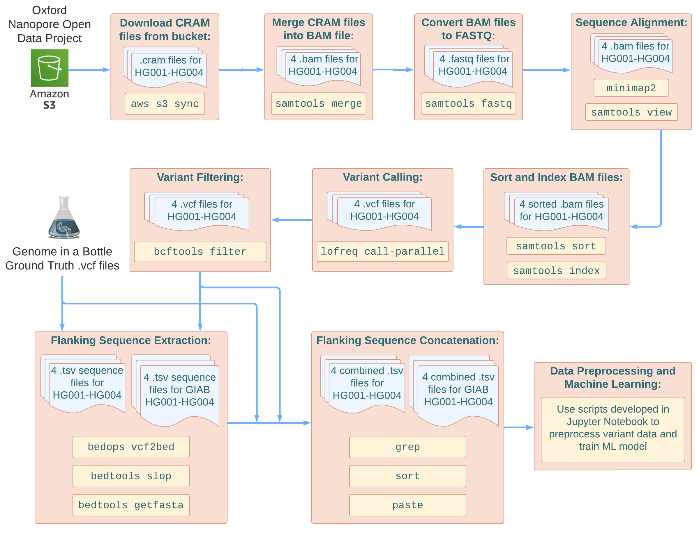

# Nextflow Pipeline to Call Variants from Nanopore Reads
This is a Nextflow pipeline designed to call variants from nanopore-sequenced human genome data characterized by the [Genome in a Bottle Consortium (GIAB)](https://www.nist.gov/programs-projects/genome-bottle), in an effort to train deep learning models to classify sequencing artifacts from true genetic variants. The goal of GIAB is to characterize specific reference genomes and datasets to produce ground truth datasets, in order to facilitate benchmarking and validation efforts. The pipeline also extracts other features from the variant data besides VCF data, including nucleotide sequence context surrounding each called variant, obtained from the reference genome. 

## Data Availability
The input data used in this pipeline consists of CRAM alignment files from GIAB-benchmarked genomes: HG001, HG002, HG003, and HG004. They were obtained via Oxford Nanopore sequencing using PromethION flow cells, and are part of the Oxford Nanopore Open Data project.  

As of 9/24/2024, the website describing data provenance can be found at: https://labs.epi2me.io/giab-2023.05/  

Also, the AWS s3 bucket address containing the data can be found at: s3://ont-open-data/giab_2023.05/

## Pipeline Dependencies
This pipeline uses the following packages: (managed through conda environments in `envs/`)
* samtools (1.18)
* minimap2 (2.26)
* lofreq (2.1.5)
* bcftools (1.17)
* bedops (2.4.41)
* bedtools (2.31.1)  
NOTE: These package versions were used in the pipeline, but other versions may work as well.

## Usage Instructions
The pipeline is configured to run in an HPC environment using nextflow and conda.
1. First, clone the git repo into your local environment  
`git clone https://github.com/dzezy/nanopore_ML.git`
2. Download necessary CRAM (and associated .CRAI) data for HG001-HG004 from the aforementioned AWS s3 bucket using AWS CLI. Only "PASS" data was used, for the "sup" basecalling mode. All CRAM and CRAI filenames should have their sample ID as prefix, ie) "HG001_filename.pass.cram" and "HG001_filename.pass.cram.crai"
3. Download GIAB benchmark VCF and BED files for HG001-HG004, as well as GIAB hg38 v3 FASTA reference and its FAI index, from:
   https://ftp-trace.ncbi.nlm.nih.gov/ReferenceSamples/giab/release/
4. Configure data path parameters as shown in `nextflow.config` to match all input data, benchmark, and reference file locations. Default is subdirectories of `data/` named "cram", "hg38", and "GIAB"
5. Also, in `nextflow.config`, configure job scheduler (SLURM by default) and resource parameters, such as threads and memory per process. Can also adjust parameters `min_alt_cov` (minimum alt coverage) for variant filtering leniency/stringency, or `flanking_seq_length` (length of nucleotide context sequence to extract on each side of variant locus), for longer or shorter context sequences. 
6. To run pipeline, make sure nextflow and conda are in your PATH, then run `nextflow run main.nf` as a job. Alternatively, configure `run.sh` for your own environment and/or scheduler and submit it as a batch job script for ease of use.  
  
After finishing, the pipeline publishes resulting .tsv files for each sample (8 total) in `output/final_tsv` containing VCF information as well as nucleotide context sequences for each variant. These .tsv files are then used for downstream analysis, labeling, and deep learning. 
